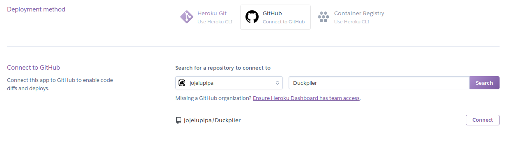
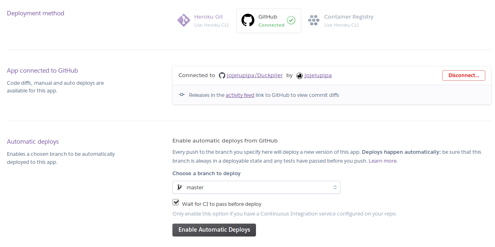

# Proyecto_IV
Proyecto para la asignatura Infraestructura Virtual (UGR)

**Duckpiler assistant**

El proyecto a desarrollar será un servicio que proporcione un pdf que
sea el resultado de una compilación de un fichero LaTeX o Markdown.


## ¿Por qué?

En numerosas ocasiones, trabajando en el [repositorio de los apuntes
de libreim](https://github.com/libreim/apuntesDGIIM) se ha dado el
caso de que algún compañero estaba intentando estudiar pero se
encontraba desde algún dispositivo móvil, desde algún sistema
operativo inapropiado o simplemente no tenía herramientas de
compilación a mano. Por lo que se pensó hacer algún tipo de compilador
automático que resuelva este problema. 

## Añadiendo Integración Continua

### Herramientas utilizadas

Para llevar a cabo los tests se han usado (dada la simplicidad de los
tests actuales) el
módulo [assert](https://nodejs.org/api/assert.html), que se encuentra
incluído en node. Si posteriormente se observase un beneficio por
utilizar [chai](https://www.chaijs.com/) para realizar tests más
complejos no sería ningún problema incluirlo en el proyecto.

Para ejecutar los tests se ha usado [Mocha](https://mochajs.org/),
pues es un framework bastante extendido y cómodo que nos describe el
resultado de la ejecución de los tests junto al tiempo transcurrido
(lo cual puede ayudar a la hora de establecer algún benchmark para
probar la aplicación).

Para gestionar la integración continua se ha
utilizado [travis](https://travis-ci.org/), principalmente por su
integración con github y su facilidad de uso.

## Desplegando

### Desplegando en Heroku

Se ha elegido Heroku como PaaS para desplegar la aplicación,
principalmente por ser una de las mejores herramientas gratuitas que
se integran bien con node.js. Proporciona otras
facilidades como la sencillez con la que se pueden desplegar
aplicaciones con simplemente hacer `push` al repositorio de Heroku (de
hecho, con la configuración adecuada se puede gestionar el push
automático con cada push al repositorio de github). Permite
seleccionar la región del servidor en la que estará tu aplicación y
permite “dormir” o desactivar las aplicaciones cuando estén un tiempo
sin ser usadas para permitir ahorrar recursos.

Para crear la app primero debemos pedirle a heroku que la cree en
nuestra región. En nuestro repositorio ejecutaríamos:

```heroku apps:create --region eu ```

Esto nos dará una aplicación con un nombre aleatorio. Así que podemos
renombrarlo al nombre que queremos.

```heroku apps:rename --app nombre-aleatorio-69349 genuine-duckpiler```

Y es importante destacar que esto implica que hay que cambiar la url
del remote de heroku, pues en caso contrario intentaríamos publicar en
un repo de heroku que ya no existe.

```git remote set-url heroku
https://git.heroku.com/genuine-duckpiler.git```

Antes de publicarlo necesitamos añadir a nuestro proyecto un archivo
`Procfile` que indique cómo se debe lanzar la aplicación. Este fichero
simplemente tendrá `web: node src/index.js`. Y para publicarlo
tendríamos que hacer push a dicho repositorio. 

```git push heroku master```


Con esto tendríamos nuestra aplicación desplegada.

Despliegue aquí: [https://genuine-duckpiler.herokuapp.com/](https://genuine-duckpiler.herokuapp.com/)


### Despliegue automático desde Github

Cuando estamos trabajando es posible que queramos realizar
“simultáneamente” el despliegue en Github y en Heroku. Así ahorrarnos
tener que hacer `push` al repo de Github y de Heroku por separado.

Por suerte podemos encontrar un modo de automatizar este proceso, en
nuestro caso configuramos desde Heroku el despliegue autorizando el
acceso al repo de github. Primero tenemos que conectar la aplicación.




Y para confirmar simplemente activamos las opciones de despliegue
automático, que es compatible con CI, para que solo se despliegue en
caso de haber pasado los tests de Integración Continua.



